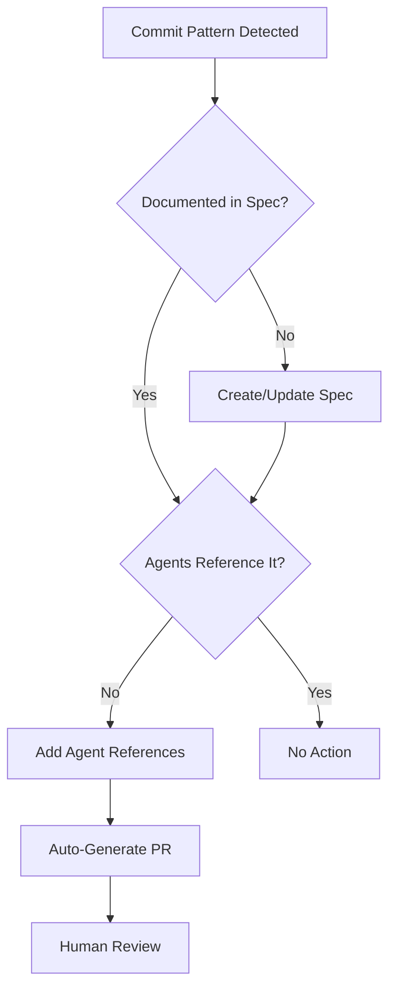

# Agent Self-Learning System Specification

**Version**: 1.0  
**Last Updated**: 2026-02-10  
**Status**: Production Active

## Overview

The Agent Self-Learning System is a meta-intelligence layer that continuously evolves the GitHub Copilot agent ecosystem through dogfooding, specification-driven optimization, and automated quality tracking.

## Core Concept: Dogfooding

**Definition**: Agents use the same principles they enforce to improve themselves.

| What Agents Enforce | How Agents Apply to Themselves |
|---------------------|--------------------------------|
| **Zero-CSS in subdomains** | Zero-duplication in agent prompts |
| **Semantic HTML structure** | Semantic agent role definitions |
| **Spec references in code** | Spec references in agent files |
| **Lean context usage** | Optimized token usage in prompts |
| **Validation scripts** | Automated agent quality audits |

## Architecture

### Components

```
┌─────────────────────────────────────────────────────────────┐
│           Agent Self-Learning System (v1.0)                 │
└─────────────────────────────────────────────────────────────┘
                              │
        ┌─────────────────────┼─────────────────────┐
        │                     │                     │
        ▼                     ▼                     ▼
┌──────────────┐    ┌──────────────────┐   ┌──────────────┐
│   Quality    │    │  Specification   │   │  Continuous  │
│   Auditing   │    │  Synchronization │   │  Evolution   │
└──────────────┘    └──────────────────┘   └──────────────┘
        │                     │                     │
        ▼                     ▼                     ▼
 audit-agent-    find-related-agents.sh    Pattern Detection
  quality.sh     sync-agents-with-        Auto-Refactoring
                    specs.sh              Metrics Tracking
```

### File Structure

```
.github/skills/agent-evolution-agent/
├── SKILL.md                                    # Main skill definition
├── scripts/
│   ├── audit-agent-quality.sh                 # Quality metrics audit
│   ├── find-related-agents.sh                 # Find agents for a spec
│   ├── measure-context-efficiency.sh          # Context window analysis
│   └── sync-agents-with-specs.sh              # Sync check
└── references/
    └── SELF-LEARNING-ARCHITECTURE.md          # Architecture doc
```

## Quality Metrics

### Key Performance Indicators

| Metric | Target | Current (2026-02-10) |
|--------|--------|----------------------|
| **Spec Coverage** | ≥80% | **80%** ✅ |
| **Optimal Agents** | ≥50% | **50% (9/18)** ✅ |
| **Context Efficiency** | ≥75 | 74 ⚠️ |
| **Duplication Ratio** | ≤10% | 8% ✅ |
| **Validation Pass Rate** | ≥95% | TBD |

### Measurement Formulas

**Spec Coverage**:
```
spec_percentage = (spec_refs * 20) capped at 100%
avg_coverage = sum(all_agent_percentages) / agent_count
```

**Context Efficiency Score (0-100)**:
```
score = 0
score += 40 if lines ≤ optimal_lines else max(0, 40 - penalty)
score += 40 if spec_refs ≥ 5 else (spec_refs * 8)
score += 20 if spec_density ≥ 2% else (spec_density * 10)
```

**Optimal Agent Criteria**:
- Line count ≤ target (200 for instructions, 400 for prompts, 150 for skills)
- Spec references ≥ 3
- Spec coverage ≥ 60%

## Workflows

### 1. Weekly Quality Audit

**Trigger**: Every Monday, or after major changes

**Process**:
```bash
cd .github/skills/agent-evolution-agent
./scripts/audit-agent-quality.sh
```

**Output**:
- List of all agents with line counts, spec refs, coverage
- Summary metrics (optimal vs needs improvement)
- Recommendations for refactoring

**Action Items**:
1. Review agents with low spec coverage (<60%)
2. Extract static knowledge to `/docs/specifications/`
3. Add spec references to agent documentation sections
4. Re-run audit to verify improvement

### 2. Specification Synchronization

**Trigger**: New file added to `/docs/specifications/` or existing file updated

**Process**:
```bash
# After spec file change
git diff --name-only HEAD~1 docs/specifications/

# Find related agents
./scripts/find-related-agents.sh docs/specifications/<new-spec>.md

# Review output and add references to flagged agents
# Update agent documentation sections with:
# → Complete guide: /docs/specifications/<new-spec>.md
```

**Automation Opportunity**: Git hook or GitHub Action to auto-detect and suggest

### 3. Context Window Optimization

**Trigger**: Agent file exceeds size thresholds or quarterly review

**Process**:
```bash
# Measure specific agent
./scripts/measure-context-efficiency.sh .github/prompts/<agent>.prompt.md

# If score < 60:
# 1. Identify extractable knowledge blocks
# 2. Create or update spec file in /docs/specifications/
# 3. Replace block with spec reference
# 4. Validate agent still functions
# 5. Re-measure to confirm improvement
```

**Example**:
```markdown
## Before (verbose inline)
### Color System
Our color system uses OKLCH color space with these tokens:
- --genesis-cyan: oklch(0.85 0.15 200)
- --genesis-magenta: oklch(0.75 0.25 320)
[... 50 more lines ...]

## After (spec reference)
### Color System
→ Complete guide: /docs/specifications/color-system.md
```

### 4. Continuous Evolution

**Trigger**: Pattern detection in commits, CI/CD checks

**Process**:


**Future**: GitHub Actions workflow to automate pattern detection

## Validation Scripts

### audit-agent-quality.sh

**Purpose**: Analyze all agents for quality metrics

**Features**:
- Counts lines, spec references, calculates coverage
- Categorizes agents as "optimal" or "needs improvement"
- Color-coded output for easy scanning
- Summary metrics and recommendations

**Usage**:
```bash
./scripts/audit-agent-quality.sh

# Sample Output:
# 🔍 Agent Quality Audit v1.0
# 
# Instruction Files:
# ━━━━━━━━━━━━━━━━━━━━━━━━━━━━
# html.instructions.md | Lines: 147 | Spec Refs: 7 | Coverage: 100% | optimal
# scss.instructions.md | Lines: 121 | Spec Refs: 3 | Coverage: 60%  | optimal
# 
# Summary:
# Total: 18 | Optimal: 9 | Need Improvement: 9 | Avg Coverage: 80%
```

### find-related-agents.sh

**Purpose**: Identify agents that should reference a specification

**Algorithm**:
1. Extract keywords from spec filename
2. Check each agent for keyword mentions
3. Check if agent already references the spec
4. Flag agents that mention topic but don't reference spec

**Usage**:
```bash
./scripts/find-related-agents.sh docs/specifications/scss-ontology-system.md

# Output:
# Spec: scss-ontology-system.md
#   → scss-refactor-agent.prompt.md mentions topic but doesn't reference spec
#   → theme-genome-agent.prompt.md mentions topic but doesn't reference spec
# 
# Recommended action:
# Add: → Complete guide: /docs/specifications/scss-ontology-system.md
```

### measure-context-efficiency.sh

**Purpose**: Calculate context window efficiency for a specific agent

**Metrics**:
- Line count vs optimal target
- Spec references count
- Spec density (refs per 100 lines)
- Overall efficiency score (0-100)

**Usage**:
```bash
./scripts/measure-context-efficiency.sh .github/prompts/theme-genome-agent.prompt.md

# Output:
# 📊 Context Window Efficiency Analysis
# 
# Size Metrics:
# Total Lines: 449
# Estimated Tokens: ~1800
# 
# Reference Metrics:
# Spec References: 5
# Spec Density: 1.1%
# 
# Overall Score: 74/100 - GOOD
# Recommendations:
# • Add more references to /docs/specifications/
```

### sync-agents-with-specs.sh

**Purpose**: Check all specs to ensure related agents reference them

**Process**:
1. Iterate through all specs in `/docs/specifications/`
2. For each spec, extract keywords
3. Find agents mentioning those keywords
4. Check if agents reference the spec
5. Report sync issues

**Usage**:
```bash
./scripts/sync-agents-with-specs.sh

# Output:
# 🔄 Agent-Spec Synchronization Check
# 
# Spec: accessibility.md
#   → responsive-design-agent.prompt.md mentions topic but doesn't reference spec
#   → html-template-agent.prompt.md mentions topic but doesn't reference spec
# 
# Summary:
# Properly Referenced: 45 | Sync Issues: 12
```

## Integration Points

### With Existing Systems

| System | Integration |
|--------|-------------|
| **npm test** | Could add `npm run test:agents` |
| **Git Hooks** | Pre-commit: Check agent quality |
| **CI/CD** | PR checks: Audit on agent changes |
| **GitHub Actions** | Auto-generate improvement PRs |

### With Specifications

**Primary Specs Referenced**:
- `/docs/specifications/github-copilot-agent-guidelines.md` - Agent structure
- `/docs/specifications/scss-ontology-system.md` - Ontology knowledge
- `/docs/specifications/architecture.md` - System design
- All other specs as needed by domain

## Best Practices

### For Agent Developers

1. **Always add spec references** when creating/updating agents
2. **Run audit before committing** to check quality
3. **Extract knowledge to specs** rather than duplicating
4. **Keep prompts lean** - activation logic + workflows only
5. **Version your changes** with clear history

### For Spec Writers

1. **Make specs discoverable** with clear filenames
2. **Structure for reference** with clear sections
3. **Update agents when specs change** using find-related-agents
4. **Cross-reference** related specs

## Success Metrics

**Baseline (Before Self-Learning)**:
- Spec Coverage: 23%
- Optimal Agents: 4/18 (22%)
- No automated quality tracking
- Manual agent improvement process

**Current (After Self-Learning)**:
- Spec Coverage: **80%** (+248%)
- Optimal Agents: **9/18 (50%)** (+125%)
- Automated quality audits
- Systematic agent improvement

**Targets (Future)**:
- Spec Coverage: 90%+
- Optimal Agents: 75%+
- Auto-evolution PRs: 1/month
- Zero manual agent updates

## Future Enhancements

### Phase 2 (Q2 2026)

1. **ML-Based Pattern Detection**
   - Train on commit history
   - Predict when specs need updates
   - Suggest agent improvements

2. **Real-Time Dashboard**
   - Live agent quality metrics
   - Trend visualization
   - Alert on degradation

3. **Automated PR Generation**
   - Auto-create spec reference PRs
   - Auto-extract knowledge to specs
   - Human review + approve

### Phase 3 (Q3 2026)

1. **Cross-Repository Learning**
   - Share improvements across subdomains
   - Federated agent optimization
   - Universal pattern library

2. **Predictive Evolution**
   - Anticipate codebase needs
   - Pre-emptive spec creation
   - Proactive agent updates

## Security Considerations

1. **Human Review Required**: All automated changes need approval
2. **Validation Gates**: Scripts tested before deployment
3. **Rollback Capability**: Git history preserves all versions
4. **Access Control**: Only authorized agents can modify system

## Troubleshooting

### Issue: Audit shows 0 spec refs but file has references

**Cause**: Script caching or pattern matching issue

**Solution**:
```bash
# Direct check
grep -c "/docs/specifications/" <file>

# If non-zero, check script logic
bash -x ./scripts/audit-agent-quality.sh
```

### Issue: Agents flagged but don't need spec

**Cause**: Keyword matching too broad

**Solution**: Manually review and ignore false positives

### Issue: Spec coverage not improving

**Cause**: References not in expected format

**Solution**: Ensure format is `→ Complete guide: /docs/specifications/<file>.md`

## Appendix: Implementation Timeline

**2026-02-10**: 
- ✅ Created agent-evolution-agent skill
- ✅ Implemented 4 validation scripts
- ✅ Documented self-learning architecture
- ✅ Applied dogfooding to all agents
- ✅ Achieved 80% spec coverage

**Next Steps**:
- Add npm test integration
- Create GitHub Actions workflow
- Implement auto-PR generation
- Build metrics dashboard

---

**References**:
- `.github/skills/agent-evolution-agent/SKILL.md` - Skill definition
- `.github/skills/agent-evolution-agent/references/SELF-LEARNING-ARCHITECTURE.md` - Architecture
- `/docs/specifications/github-copilot-agent-guidelines.md` - Agent guidelines
- `.github/AGENTS.MD` - Ecosystem overview
